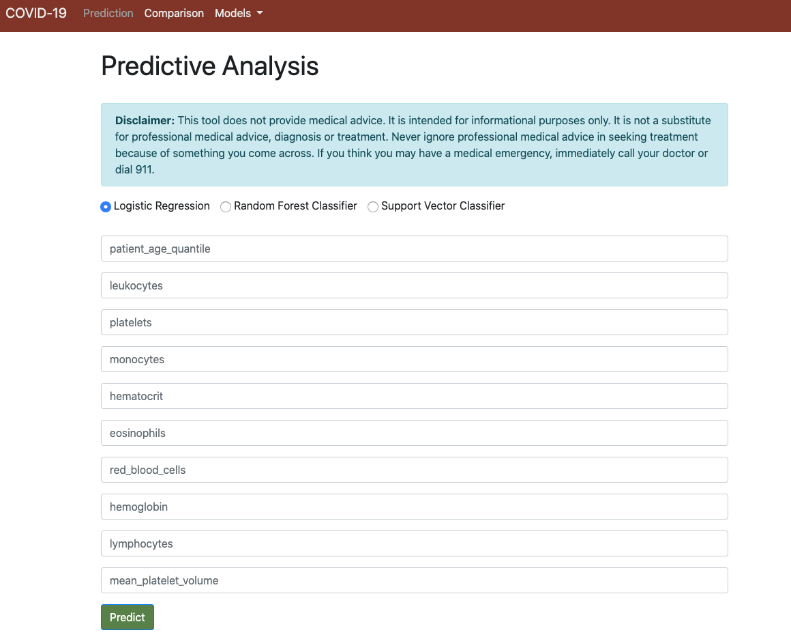
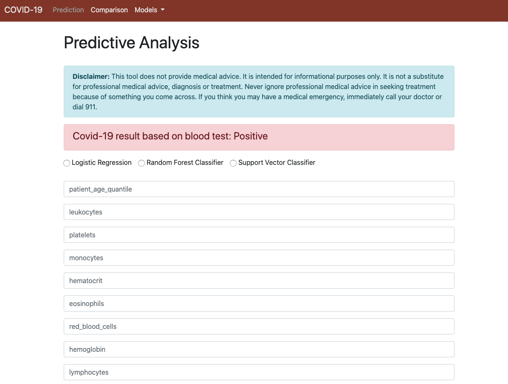
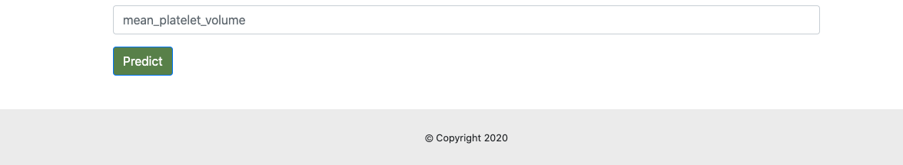
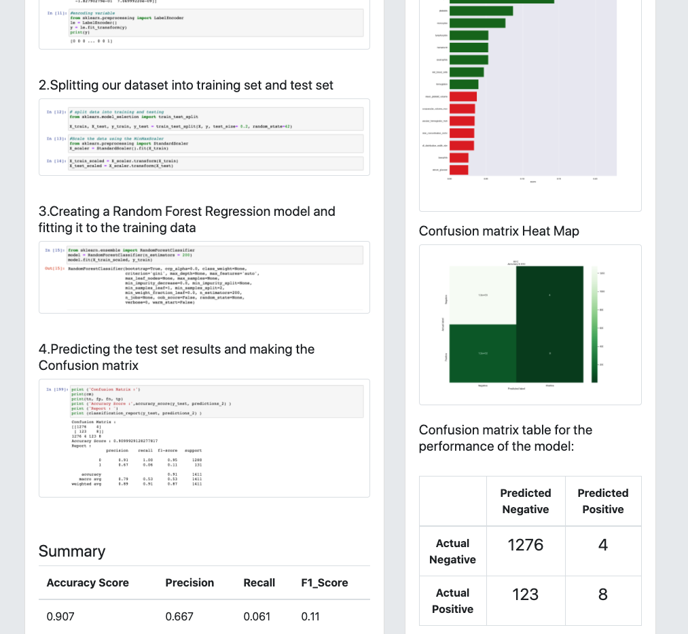
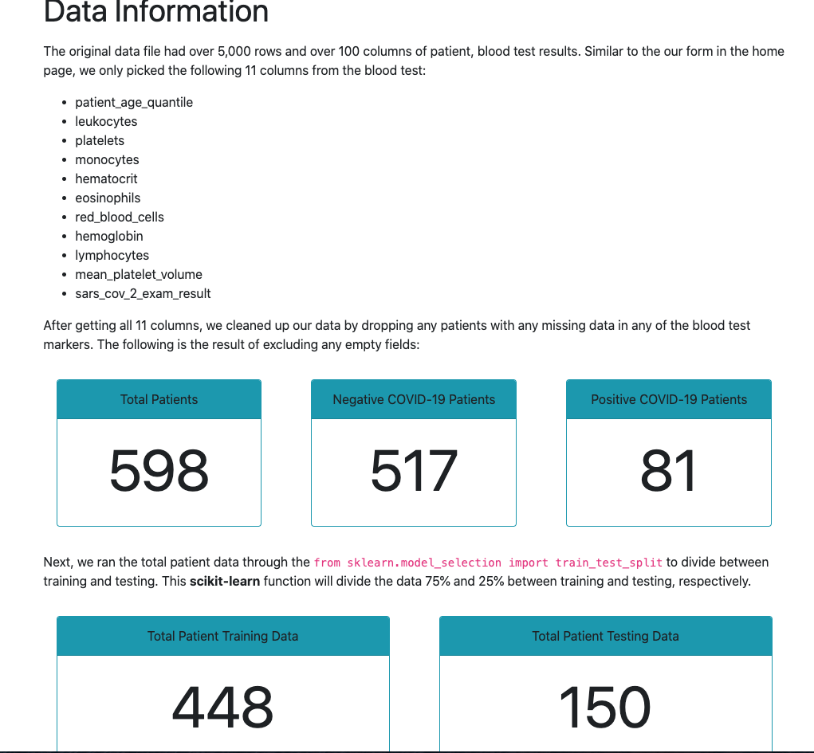
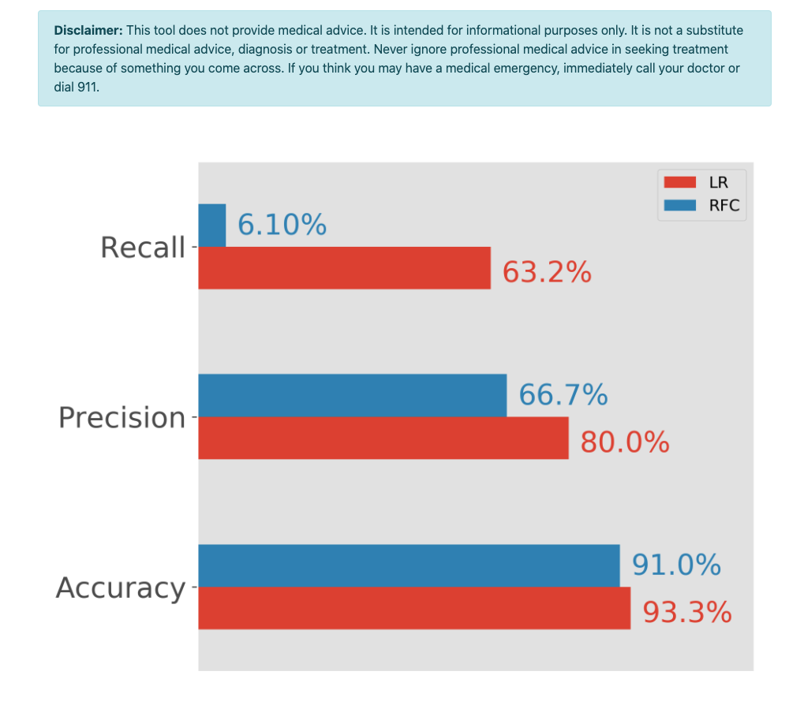

# COVID-19 Machine Learning Analysis
## Team Members (Alphabetical Order):
- Alexis Perumal
- Arundhati Chakraborty
- David Jaimes
- Grant Thompson

## Source Dataset:
Our machine learning models uses data from the UNCOVER COVID-19 Challenge. Shared by the Roche Data Science Coalition (RDSC), they are requesting the collaborative effort of the AI community to fight COVID-19. This challenge presents a curated collection of datasets from 20 global sources and asks you to model solutions to key questions that were developed and evaluated by a global frontline of healthcare providers, hospitals, suppliers, and policy makers.

https://www.kaggle.com/roche-data-science-coalition/uncover

## Summary:
The data has 5,644 rows and over 100 columns of patients, out of which top 10 columns were selected based on the model scores, these features are listed to our prediction form in the home page.In this project we have used several models( Logistic Regression, Random Forest Classifier, Support Vector Classifier etc.. for possible prediction of the test result for COVID-19 (positive/negative) based on the below listed column features:

- patient_age_quantile
- leukocytes 
- platelets
- monocytes
- hematocrit
- eosinophils
- red_blood_cells
- lymphocytes
- hemoglobin
- mean_platelet_volume

## Installation and steps to run the app:
**NOTE**: These install instructions is only for setting up your environment the first time. No need to rerun all steps after you've created your database. Simply run the following command: python app.py in `pipenv shell`.
- cd Deployment-flask
- python3 —version -> make sure python version is 3.*
- pip3 install pipenv -> virtual enviornment
- pipenv shell -> activate the virtual env
- pipenv install flask flask-sqlalchemy flask-marshmallow marshmallow-sqlalchemy scikit-learn -> install the relevant libraries in your virtual env
- python3 -> go python shell
- from app import db 
- db.create.all() -> creating the sqlite database

## Libraries:

-	ML Analysis: SciKit-Learn (Classifiers and/or regressors), Pandas, TensorFlow (neural networks), Jupyter Notebooks, Python
-	Server:  flask flask-sqlalchemy flask-marshmallow marshmallow-sqlalchemy
-	Visualization: html, bootstrap, css
-   Database:  SQLite

## Screen Shots:

